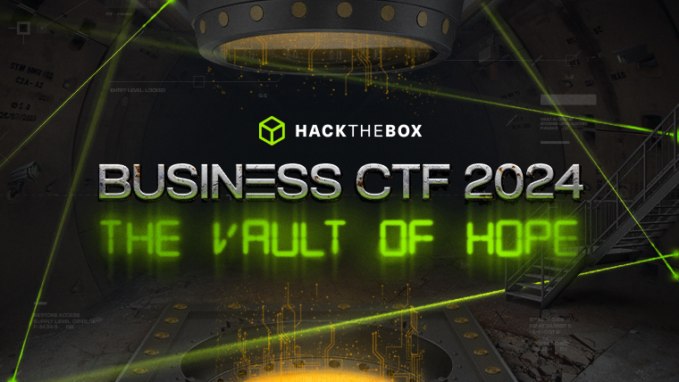

# Recruitment


---


> 10<sup>th</sup> May 2024 \
Prepared By: perrythepwner \
Challenge Author(s): perrythepwner \
Difficulty: <font color=green>Easy</font>


# Synopsis

- This challenge serves as an entry-level warmup for the blockchain category. Players will learn how to interact with the infrastructure and solve the challenge by satisfying transaction constraints.

## Description

- Do you think you have what it takes to live up to this crew? apply and prove it.

## Skills Required

- Smart contract interaction.


## Skills Learned

- Smart contract interaction.
- block.timestamp, block.number, tx.origin, msg.sender, gasleft().

## Analyzing the source code

Let's examine the provided source code.

**Setup.sol**
```solidity
pragma solidity 0.8.25;

import {Recruitment} from "./Recruitment.sol";

contract Setup {
    Recruitment public immutable TARGET;

    constructor() payable {
        TARGET = new Recruitment{value: 1 wei}();
    }

    function isSolved() public view returns (bool) {
        return TARGET.isRecruited(msg.sender);
    }
}

```

This setup will deploy the challenge instance for us. It appears that a `TARGET` contract will be deployed with `10 ether` in it. To solve the challenge, the `isRectruited()` function must return true with the player address as argument.

**Recruitment.sol**
```solidity
pragma solidity 0.8.25;

contract Recruitment {
    constructor() payable {}

    mapping (address => bool) public crew;

    function isRecruited(address _candidate) public view returns (bool) {
        return crew[_candidate];
    }

    function application(uint16 input1, string memory input2) public {
        // In order to be eligible, you must match the following set of skills:
        // - Hacker
        // - Stealth Specialist
        // - Engineer
        // - Demolition Specialist

        // Let's start!
        // Some preliminary checks: we do not hire unlucky people.
        require(block.timestamp % 2 == 0, "Natural selection people say..");

        // CAPTCHA (Completely Automated Public Turing test to tell Computers and Humans Apart)
        require(tx.origin == msg.sender, "Are you even human?");

        // Now let's start for real.
        // 1. Are you an hacker?
        require(input1 == 1337, "You lack hacking skills.");
        // yeah you definitely are.

        // 2. Are you stealthy?
        require(block.number < 20, "You lack stealth skills.");

        // 3. Are you an engineer?
        require(gasleft() <= 50000, "You lack engineering skills.");

        // 4. Are you a demolition specialist?
        require(keccak256(abi.encodePacked(input2)) == keccak256(abi.encodePacked("BOOM")), "You lack demolition skills.");

        // Congratulations! Welcome to the crew.
        crew[msg.sender] = true;
        // here is your reward :)
        payable(msg.sender).transfer(1 wei);
        }
}
```
The `isRecruited()` function fetch the `crew` mapping that tracks wheter a player is recruited in the crew or not.  
At `L35` it's possible to write the player address in this mapping.
In order to reach this goal we have to satisfy the preceding require statements and therefore prevent the transaction from reverting.  
Let's explore the conditions.

### Condition 1
```solidity
require(block.timestamp % 2 == 0, "Natural selection people say..");
```
The first condition ensure that the timestamp (current block timestamp as seconds since unix epoch) is even. Since this isn't a random value it's easy for the player to send the transaction at a specific time or just flip the coin.

### Condition 2
```solidity
require(tx.origin == msg.sender, "Are you even human?");
```
The second condition forbids interaction of external smart contract. Since the tx.origin (the original sender of the transaction) must be the same as the final transaction, no intermediary, such as a smart contract, can bypass this check.

### Condition 3
```solidity
require(input1 == 1337, "You lack hacking skills.");
```
The third require statement is actually the first check about the mentioned required skills. The first skill to match is the "Hacking skill" which just require to send `1337` as first function argument. A [very hacky number](https://en.wikipedia.org/wiki/Leet).

### Condition 4
```solidity
require(block.number < 20, "You lack stealth skills.");
```
The second skill check is about "Stealthiness". In a real smart contract attack scenario, the interaction must be clinical. Hence, in order to solve this challenge the player must solve it in the first 20 blocks (which isn't really stealthy but players sanity was preferred).

### Condition 5
```solidity
require(gasleft() < 20000, "You lack engineering skills.");
```
The third skill requires to be an "Engineer". Indeed players need to engineer their gas consumption by sending a transaction with very low gas avaiability such that when the execution reaches this point, there are no more than 20000 gas left.
This can be accomplished by setting a gas threshold when calling the contract. Using [cast](https://book.getfoundry.sh/cast/) tool this can be done with the `--gas-limit` option.

### Condition 6
```solidity
require(abi.encodePacked(input2) == abi.encodePacked("BOOM"), "You lack demolition skills.");
```
The final requirement is to be a "Demolition Specialist". And what distinguishes a demolition specialist? Obviously in sending the string `BOOM` as the second function argument.

## Exploitation

Firstly To interact with the challenge blockchain, various tools are available to us, such as [web3.py](https://github.com/ethereum/web3.py)/[web3js](https://web3js.org/) library, [cast](https://book.getfoundry.sh/cast/) tool, and others.  
In this example will be used `cast`.  
To send a state-changing transaction to a contract we have to use the `send` subcommand of cast.  
To specify the function to call and it's arguments it'll be sufficient to use the function signature (function name + argument types separated by comma and without spaces) followed by our inputs, like the following:
```sh
$ cast send --help
Sign and publish a transaction

Usage: cast send [OPTIONS] [TO] [SIG] [ARGS]... [COMMAND]

$ cast send $CONTRACT_ADDR "application(uint16,string)" 1337 "BOOM"
```
We also need to specify the gas usage. 60k gas is low enough to solve the challenge. Our command becomes:
```sh
$ cast send $CONTRACT_ADDR "application(uint16,string)" 1337 "BOOM" --gas-limit 60000
```
Finally, we need to specify the given `--rpc-url` and our player `--private-key` provided by the infrastructure.

```sh
$ cast send $CONTRACT_ADDR "application(uint16,string)" 1337 "BOOM" --gas-limit 60000 --rpc-url $RPC --private-key $PVK
```


## Fetching the information

Upon launching the challenge, we will encounter two sockets. One socket serves as the challenge handler, while the other serves as the RPC endpoint. Upon connecting to the challenge handler, we will be presented with three options:

```shell
$ nc 0.0.0.0 1338
1 - Connection information
2 - Restart Instance
3 - Get flag
action?
```

Before proceeding, it's essential to launch the game instance, which will provide us with the necessary information to establish a connection.

```shell
$ nc 0.0.0.0 1338
1 - Connection information
2 - Restart Instance
3 - Get flag
action? 1

Private key     :  0x1e7ed27cf8804c820d69d04b69745634b54a989112752dd4ddd540e4dd6c1bc5
Address         :  0x18Bdd72777BccB5bCb5590bE6c947B68B38066c6
Target contract :  0x406607888e97f1f4F1cb225fC002DF46b50a85D0
Setup contract  :  0xC8333ab86099e2cDe792F81C4BA830CCb17D9B68
```

## Getting the flag

We can create a simple Python script to execute a `cast send` command repeatedly until we solve the "50/50" condition and get the flag.

```python
    while True:
        # try luck
        csend(target, "application(uint16,string)", "1337", "BOOM")

        # get flag
        with remote(TCP_URL.split(":")[0], int(TCP_URL.split(":")[1])) as p:
            p.recvuntil(b"action? ")
            p.sendline(b"3")
            flag = p.recvall().decode()

        if "HTB" in flag:
            print(f"\n\n[*] {flag}")
            break
```

> HTB{th3y_s4id_W3lc0m3_Ab0ard}